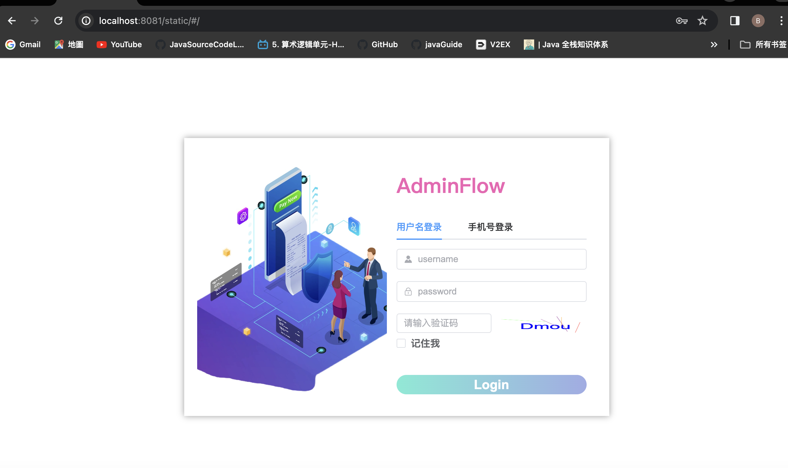
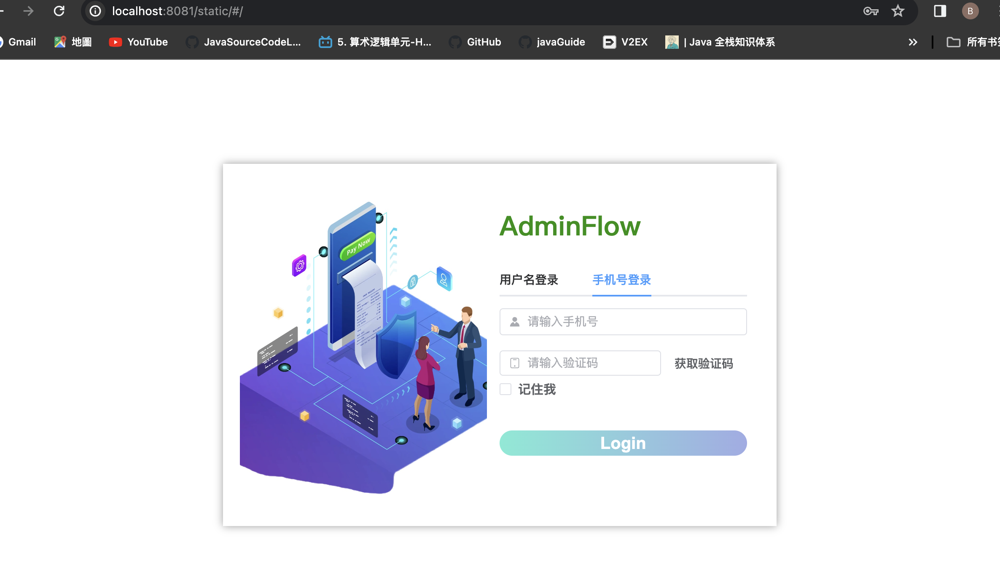
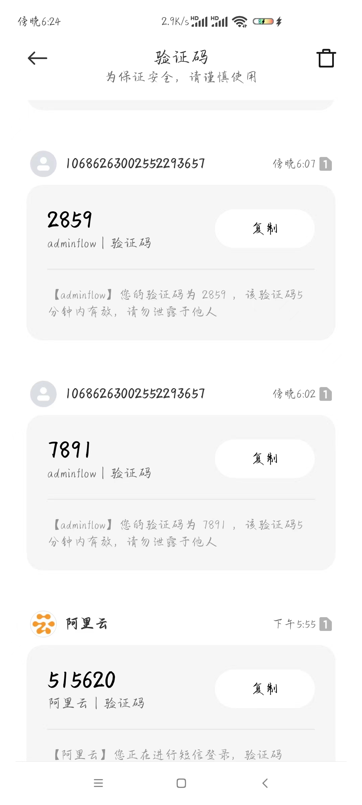
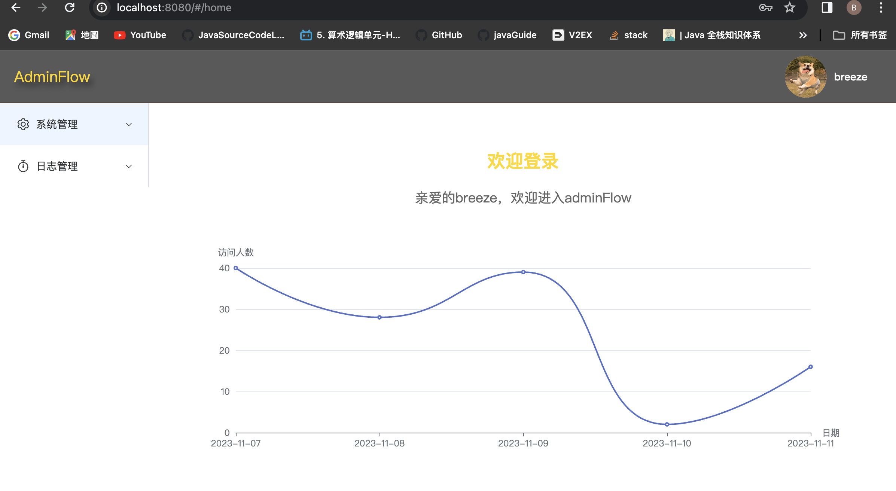
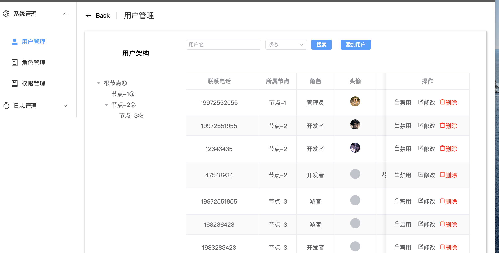
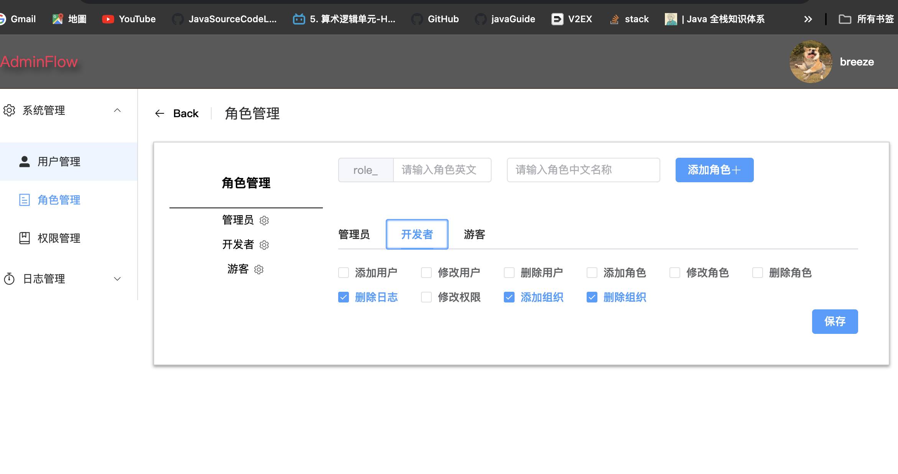
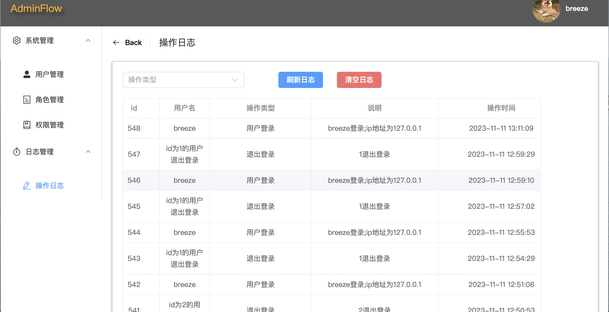
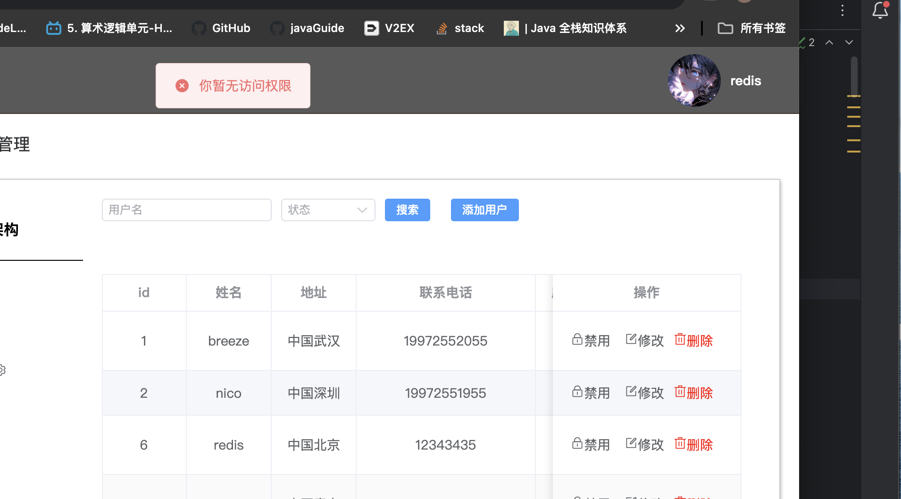
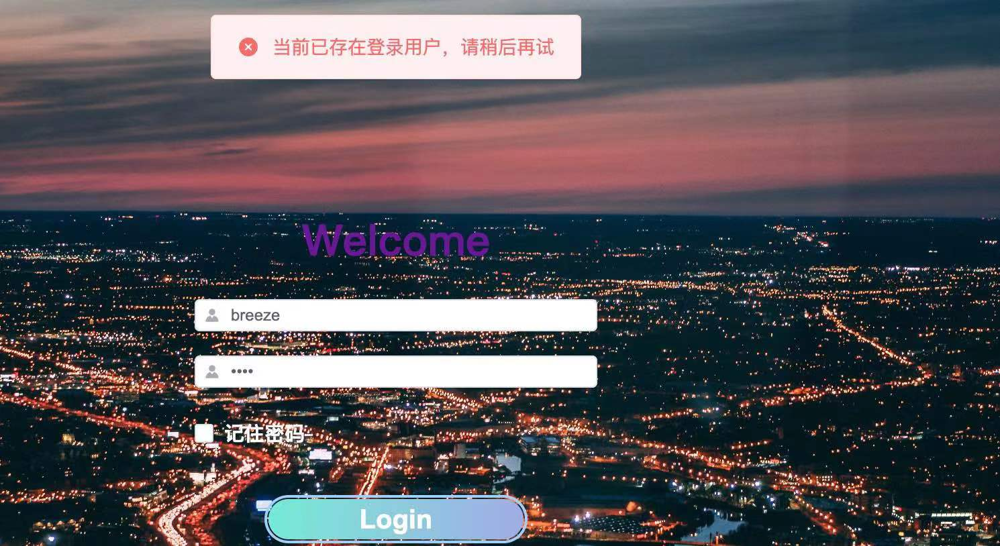
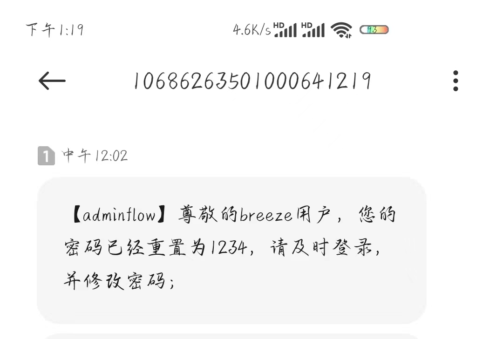

## AdminFlow

#### 项目说明

技术栈(springboot3.0，mybatis，redis，rocketmq，vue3，Axios，Element Plus，Echarts等)，不使用安全框架，自定义RBAC权限认证
不同用户具有不同行为权限
#### 主要特性

- 两种登录方式，用户名登录，搭配阿里云服务验证码登录(利用redis做短信验证码过期功能)
- 用户登录成功，生成jwt令牌，接口携带token认证
- 使用redis进行会话管理及项目登录人数记录
- 自定义注解，实现不同用户不同角色不同行为权限控制
- 修改用户密码使用消息中间件，搭配阿里云短信服务发送短信提示
- 运用springaop对关键操作进行日志记录
- 实现记住密码等功能
- 所有接口都有测试用例覆盖，保证功能可用
#### 在线预览地址
[adminflow](http://121.40.93.139:8087/static/index.html)

#### 项目效果图

提供两种方式登录 用户名登录 搭配阿里云短信登录

