# Consul服务注册中心


　　Netflix Eureka 2.X https://github.com/Netflix/eureka/wiki官方宣告停止开发，但其实对国内的用户影响甚小，一方面国内大都使用的是 Eureka 1.X 系列，并且官方也在积极维护 1.X https://github.com/Netflix/eureka/releases。

> The existing open source work on eureka 2.0 is discontinued. The code base and artifacts that were released as part of the existing repository of work on the 2.x branch is considered use at your own risk.
>
> Eureka 1.x is a core part of Netflix's service discovery system and is still an active project.

翻译：

> 有关 eureka 2.0 的现有开源工作已停止。在 2.x 分支上作为现有工作资料库的一部分发布的代码库和工件被视为使用后果自负。
>
> Eureka 1.x 是 Netflix 服务发现系统的核心部分，仍然是一个活跃的项目。

> 虽然 Eureka，Hystrix 等不再继续开发或维护，但是目前来说不影响使用，不管怎么说感谢开源，向 Netflix 公司的开源致敬。

　　另一方面 Spring Cloud 支持很多服务发现的软件，Eureka 只是其中之一，下面是 Spring Cloud 支持的服务发现软件以及特性对比。


## 学习目标


## 常见的注册中心


- Netflix Eureka
- Alibaba Nacos
- HashiCorp Consul
- Apache ZooKeeper
- CoreOS Etcd
- CNCF CoreDNS


| 特性            | Eureka      | Nacos                      | Consul            | Zookeeper  |
| :-------------- | :---------- | :------------------------- | :---------------- | :--------- |
| CAP             | AP          | CP + AP                    | CP                | CP         |
| 健康检查        | Client Beat | TCP/HTTP/MYSQL/Client Beat | TCP/HTTP/gRPC/Cmd | Keep Alive |
| 雪崩保护        | 有          | 有                         | 无                | 无         |
| 自动注销实例    | 支持        | 支持                       | 不支持            | 支持       |
| 访问协议        | HTTP        | HTTP/DNS                   | HTTP/DNS          | TCP        |
| 监听支持        | 支持        | 支持                       | 支持              | 支持       |
| 多数据中心      | 支持        | 支持                       | 支持              | 不支持     |
| 跨注册中心同步  | 不支持      | 支持                       | 支持              | 不支持     |
| SpringCloud集成 | 支持        | 支持                       | 支持              | 支持       |


## Consul 介绍


　　Consul 是 HashiCorp 公司推出的开源工具，用于实现分布式系统的服务发现与配置。与其它分布式服务注册与发现的方案，Consul 的方案更“一站式”，内置了服务注册与发现框架、分布一致性协议实现、健康检查、Key/Value 存储、多数据中心方案，不再需要依赖其它工具（比如 ZooKeeper 等），使用起来也较为简单。

　　Consul 使用 Go 语言编写，因此具有天然可移植性（支持Linux、Windows 和 Mac OS）；安装包仅包含一个可执行文件，方便部署，与 Docker 等轻量级容器可无缝配合。


## Consul 特性


- Raft 算法

- 服务发现
- 健康检查
- Key/Value 存储
- 多数据中心
- 支持 http 和 dns 协议接口
- 官方提供 web 管理界面


## Consul 角色


- client：客户端，无状态，将 HTTP 和 DNS 接口请求转发给局域网内的服务端集群。
- server：服务端，保存配置信息，高可用集群，每个数据中心的 server 数量推荐为 3 个或者 5 个。


　　首先，图中有两个数据中心，分别为 Datacenter1 和 Datacenter2 。Consul 非常好的支持多个数据中心，每个数据中心内，有客户端和服务器端，服务器一般为 3~5 个，这样可以在稳定和性能上达到平衡，因为更多的机器会使数据同步很慢。不过客户端是没有限制的，可以有成千上万个。

　　数据中心内的所有节点都会加入到 Gossip (流言)协议。这就意味着有一个 Gossip 池，其中包含这个数据中心所有的节点。客户端不需要去配置服务器地址信息，发现服务工作会自动完成。检测故障节点的工作不是放在服务器端，而是分布式的；这使得失败检测相对于本地化的心跳机制而言，更具可拓展性。在选择 leader 这种重要的事情发生的时候，数据中心被用作消息层来做消息广播。

　　每个数据中心内的服务器都是单个 Raft 中节点集的一部分。这意味着他们一起工作，选择一个单一的领导者——一个具有额外职责的选定的服务器。leader 负责处理所有查询和事物。事物也必须作为同步协议的一部分复制到节点集中的所有节点。由于这个要求，当非 leader 服务器接收到 RPC 请求时，就会将请求其转发给集群 leader。

　　服务器端节点同时也作为 WAN Gossip 池的一部分，WAN 池和 LAN 池不同的是，它针对网络高延迟做了优化，而且只包含其他Consul 服务器的节点。这个池的目的是允许数据中心以最少的消耗方式发现对方。启动新的数据中心与加入现有的 WAN Gossip 一样简单。因为这些服务器都在这个池中运行，它还支持跨数据中心请求。当服务器收到对不同数据中心的请求时，它会将其转发到正确数据中心中的随机服务器。那个服务器可能会转发给本地的 leader。

　　这样会使数据中心的耦合非常低。但是由于故障检测，连接缓存和复用，跨数据中心请求相对快速可靠。

　　总的来说，数据不会在不同的数据中心之间做复制备份。当收到一个请求处于别的数据中心的资源时，本地的 Consul 服务器会发一个 RPC 请求到远端的 Consul 服务器，然后返回结果。如果远端数据中心处于不可用状态，那么这么资源也会不可用，但这不影响本地的数据中心。在一些特殊的情况下，有限的数据集会被跨数据中心复制备份，比如说 Consul 内置的 ACL 复制能力，或者像 consul-replicate 这样的外部工具。


## Consul 工作原理


### 服务发现以及注册


　　当服务 Producer 启动时，会将自己的 Ip/host 等信息通过发送请求告知 Consul，Consul 接收到 Producer 的注册信息后，每隔 10s（默认）会向 Producer 发送一个健康检查的请求，检验 Producer 是否健康。


### 服务调用


　　当 Consumer 请求 Product 时，会先从 Consul 中拿到存储 Product 服务的 IP 和 Port 的临时表(temp table)，从temp table 表中任选一个· Producer 的 IP 和 Port， 然后根据这个 IP 和 Port，发送访问请求；temp table 表只包含通过了健康检查的 Producer 信息，并且每隔 10s（默认）更新。


## Consul 安装


　　Eureka 其实就是个 Servlet 程序，跑在 Servlet 容器中；Consul 则是用 go 语言编写的第三方工具需要单独安装使用。


### 下载


　　访问 Consul 官网：https://www.consul.io 下载 Consul 的最新版本。

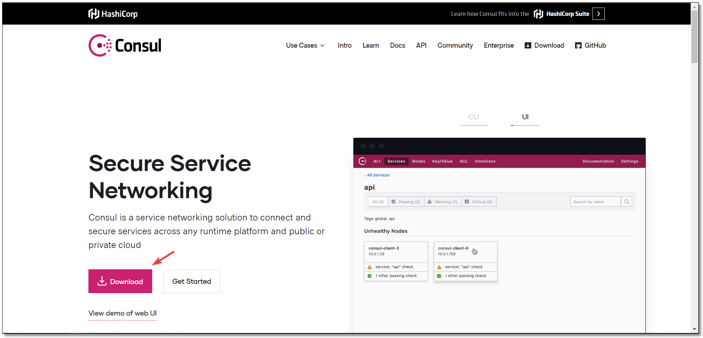


　　支持多种环境安装，截图中只显示了部分环境。

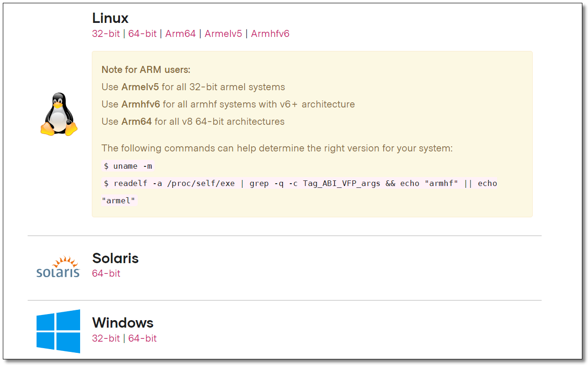


### 安装


　　为了让大家学习到不同环境的安装，单节点我们在 Windows 安装，集群环境在 Linux 安装。


#### 单节点


　　压缩包中就只有一个 `consul.exe` 的执行文件。


　　cd 到对应的目录下，使用 cmd 启动 Consul

```
# -dev表示开发模式运行，另外还有 -server 表示服务模式运行
consul agent -dev -client=0.0.0.0
```

　　为了方便启动，也可以在 consul.exe 同级目录下创建一个脚本来启动，脚本内容如下：

```shell
consul agent -dev -client=0.0.0.0
pause
```

　　访问管理后台：http://localhost:8500/ 看到下图意味着我们的 Consul 服务启动成功了。

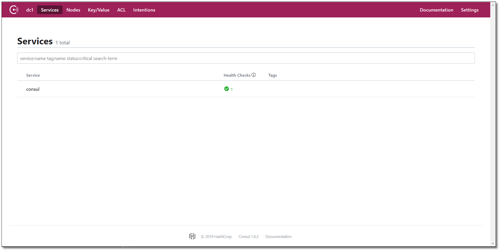


## Consul 入门案例


### 创建项目


　　我们创建聚合项目来讲解 Consul，首先创建一个 pom 父工程。


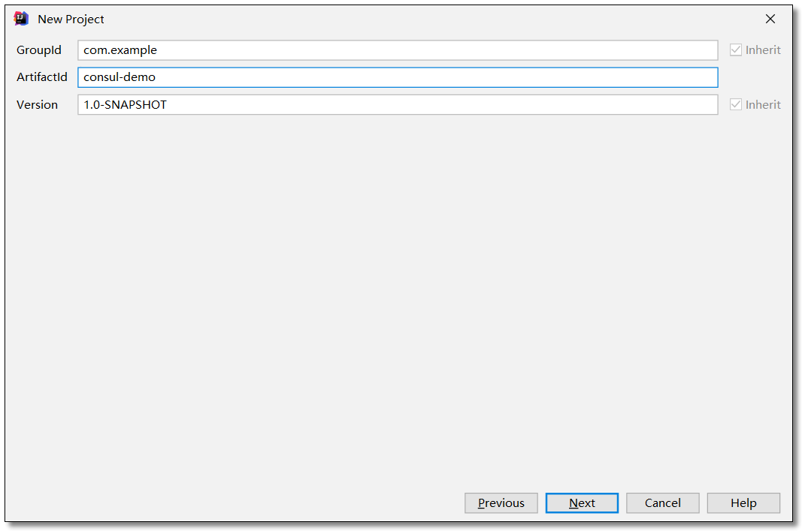

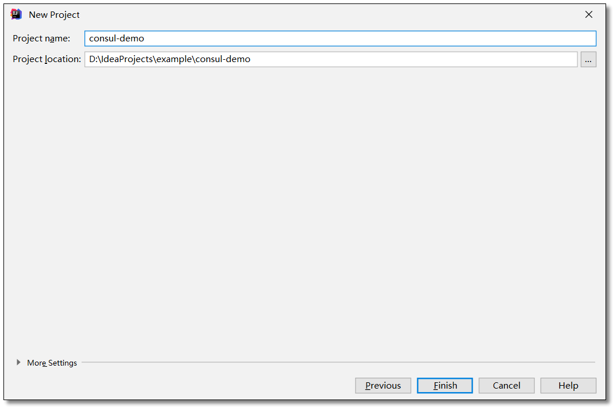


### 添加依赖


　　pom.xml

```xml
<?xml version="1.0" encoding="UTF-8"?>
<project xmlns="http://maven.apache.org/POM/4.0.0"
         xmlns:xsi="http://www.w3.org/2001/XMLSchema-instance"
         xsi:schemaLocation="http://maven.apache.org/POM/4.0.0 http://maven.apache.org/xsd/maven-4.0.0.xsd">
    <modelVersion>4.0.0</modelVersion>

    <!-- 项目坐标地址 -->
    <groupId>com.example</groupId>
    <!-- 项目模块名称 -->
    <artifactId>consul-demo</artifactId>
    <!-- 项目版本名称 快照版本SNAPSHOT、正式版本RELEASE -->
    <version>1.0-SNAPSHOT</version>

    <!-- 继承 spring-boot-starter-parent 依赖 -->
    <!-- 使用继承方式，实现复用，符合继承的都可以被使用 -->
    <parent>
        <groupId>org.springframework.boot</groupId>
        <artifactId>spring-boot-starter-parent</artifactId>
        <version>2.2.4.RELEASE</version>
    </parent>

    <!--
        集中定义依赖组件版本号，但不引入，
        在子工程中用到声明的依赖时，可以不加依赖的版本号，
        这样可以统一管理工程中用到的依赖版本
     -->
    <properties>
        <!-- Spring Cloud Hoxton.SR1 依赖 -->
        <spring-cloud.version>Hoxton.SR1</spring-cloud.version>
    </properties>

    <!-- 项目依赖管理 父项目只是声明依赖，子项目需要写明需要的依赖(可以省略版本信息) -->
    <dependencyManagement>
        <dependencies>
            <!-- spring cloud 依赖 -->
            <dependency>
                <groupId>org.springframework.cloud</groupId>
                <artifactId>spring-cloud-dependencies</artifactId>
                <version>${spring-cloud.version}</version>
                <type>pom</type>
                <scope>import</scope>
            </dependency>
        </dependencies>
    </dependencyManagement>

</project>
```


### 服务提供者 service-provider


#### 创建项目


　　在刚才的父工程下创建一个 `service-provider` 服务提供者的项目。

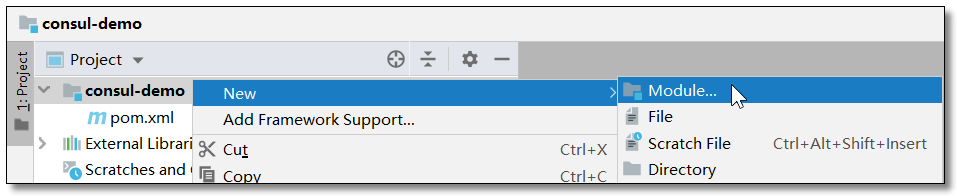


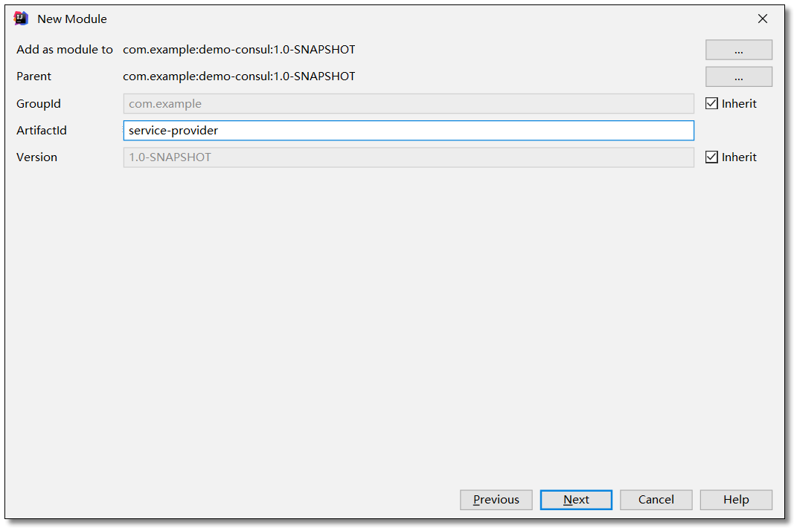


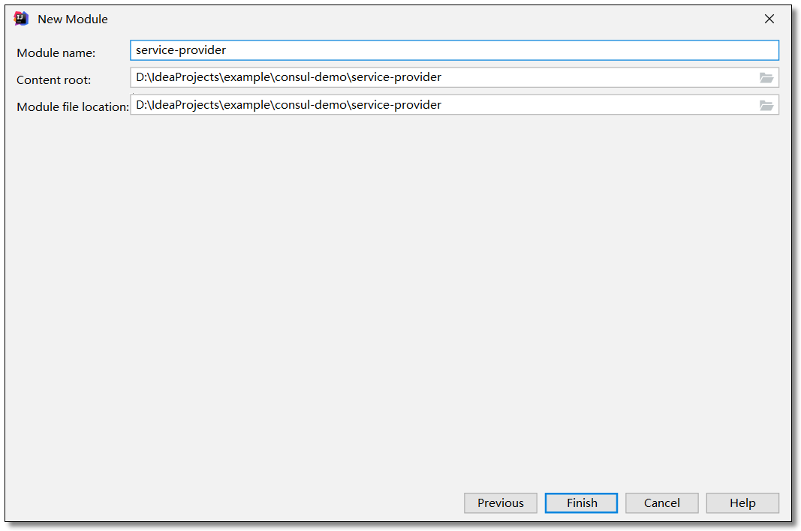


#### 添加依赖


　　pom.xml

```xml
<?xml version="1.0" encoding="UTF-8"?>

<project xmlns="http://maven.apache.org/POM/4.0.0" xmlns:xsi="http://www.w3.org/2001/XMLSchema-instance"
         xsi:schemaLocation="http://maven.apache.org/POM/4.0.0 http://maven.apache.org/xsd/maven-4.0.0.xsd">
    <modelVersion>4.0.0</modelVersion>

    <groupId>com.example</groupId>
    <artifactId>service-provider</artifactId>
    <version>1.0-SNAPSHOT</version>

    <!-- 继承父依赖 -->
    <parent>
        <groupId>com.example</groupId>
        <artifactId>consul-demo</artifactId>
        <version>1.0-SNAPSHOT</version>
    </parent>

    <!-- 项目依赖 -->
    <dependencies>
        <!-- spring cloud consul 依赖 -->
        <dependency>
            <groupId>org.springframework.cloud</groupId>
            <artifactId>spring-cloud-starter-consul-discovery</artifactId>
        </dependency>
        <!-- spring boot actuator 依赖 -->
        <dependency>
            <groupId>org.springframework.boot</groupId>
            <artifactId>spring-boot-starter-actuator</artifactId>
        </dependency>
        <!-- spring boot web 依赖 -->
        <dependency>
            <groupId>org.springframework.boot</groupId>
            <artifactId>spring-boot-starter-web</artifactId>
        </dependency>
        <!-- lombok 依赖 -->
        <dependency>
            <groupId>org.projectlombok</groupId>
            <artifactId>lombok</artifactId>
            <scope>provided</scope>
        </dependency>

        <!-- spring boot test 依赖 -->
        <dependency>
            <groupId>org.springframework.boot</groupId>
            <artifactId>spring-boot-starter-test</artifactId>
            <scope>test</scope>
            <exclusions>
                <exclusion>
                    <groupId>org.junit.vintage</groupId>
                    <artifactId>junit-vintage-engine</artifactId>
                </exclusion>
            </exclusions>
        </dependency>
    </dependencies>
  
</project>
```


#### 配置文件


　　application.yml

```yml
server:
  port: 7070 # 端口

spring:
  application:
    name: service-provider # 应用名称
  # 配置 Consul 注册中心
  cloud:
    consul:
      # 注册中心的访问地址
      host: localhost
      port: 8500
      # 服务提供者信息
      discovery:
        register: true                                # 是否需要注册
        instance-id: ${spring.application.name}-01    # 注册实例 id（必须唯一）
        service-name: ${spring.application.name}      # 服务名称
        port: ${server.port}                          # 服务端口
        prefer-ip-address: true                       # 是否使用 ip 地址注册
        ip-address: ${spring.cloud.client.ip-address} # 服务请求 ip
```


#### 实体类


　　Product.java

```java
package com.example.pojo;

import lombok.AllArgsConstructor;
import lombok.Data;
import lombok.NoArgsConstructor;

import java.io.Serializable;

@Data
@NoArgsConstructor
@AllArgsConstructor
public class Product implements Serializable {

    private Integer id;
    private String productName;
    private Integer productNum;
    private Double productPrice;

}
```


#### 编写服务


　　ProductService.java

```java
package com.example.service;

import com.example.pojo.Product;

import java.util.List;

/**
 * 商品服务
 */
public interface ProductService {

    /**
     * 查询商品列表
     *
     * @return
     */
    List<Product> selectProductList();

}
```

　　ProductServiceImpl.java

```java
package com.example.service.impl;

import com.example.pojo.Product;
import com.example.service.ProductService;
import org.springframework.stereotype.Service;

import java.util.Arrays;
import java.util.List;

/**
 * 商品服务
 */
@Service
public class ProductServiceImpl implements ProductService {

    /**
     * 查询商品列表
     *
     * @return
     */
    @Override
    public List<Product> selectProductList() {
        return Arrays.asList(
                new Product(1, "华为手机", 1, 5800D),
                new Product(2, "联想笔记本", 1, 6888D),
                new Product(3, "小米平板", 5, 2020D)
        );
    }

}
```


#### 控制层


　　ProductController.java

```java
package com.example.controller;

import com.example.pojo.Product;
import com.example.service.ProductService;
import org.springframework.beans.factory.annotation.Autowired;
import org.springframework.web.bind.annotation.GetMapping;
import org.springframework.web.bind.annotation.RequestMapping;
import org.springframework.web.bind.annotation.RestController;

import java.util.List;

@RestController
@RequestMapping("/product")
public class ProductController {

    @Autowired
    private ProductService productService;

    /**
     * 查询商品列表
     *
     * @return
     */
    @GetMapping("/list")
    public List<Product> selectProductList() {
        return productService.selectProductList();
    }

}
```

> 该项目我们可以通过单元测试进行测试，也可以直接通过 url 使用 postman 或者浏览器来进行测试。


#### 启动类


　　ServiceProviderApplication.java

```java
package com.example;

import org.springframework.boot.SpringApplication;
import org.springframework.boot.autoconfigure.SpringBootApplication;

@SpringBootApplication
public class ServiceProviderApplication {

    public static void main(String[] args) {
        SpringApplication.run(ServiceProviderApplication.class, args);
    }

}
```


#### 访问


　　访问管理后台：http://localhost:8500/ 看到下图意味着我们的服务注册至注册中心了。

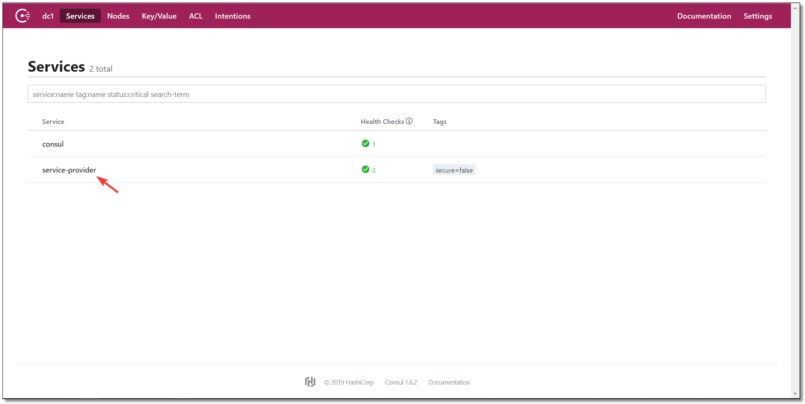

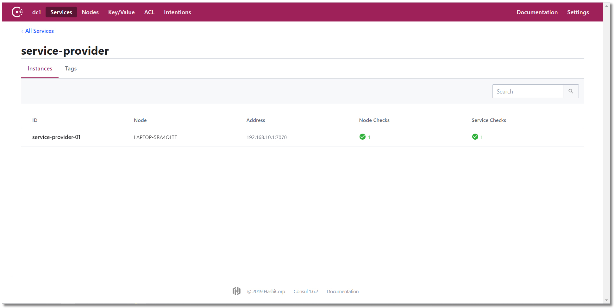


　　将 `service-provider` 项目复制一份修改端口为 `7071` ，注册实例 id 为 02。

```yml
spring:
  application:
    name: service-provider # 应用名称
  # 配置 Consul 注册中心
  cloud:
    consul:
      # 注册中心的访问地址
      host: localhost
      port: 8500
      # 服务提供者信息
      discovery:
        register: true                                # 是否需要注册
        instance-id: ${spring.application.name}-02    # 注册实例 id（必须唯一）
        service-name: ${spring.application.name}      # 服务名称
        port: ${server.port}                          # 服务端口
        prefer-ip-address: true                       # 是否使用 ip 地址注册
        ip-address: ${spring.cloud.client.ip-address} # 服务请求 ip

# 端口
server:
  port: 8602
```


　　启动 `service-provider02` 结果如下：

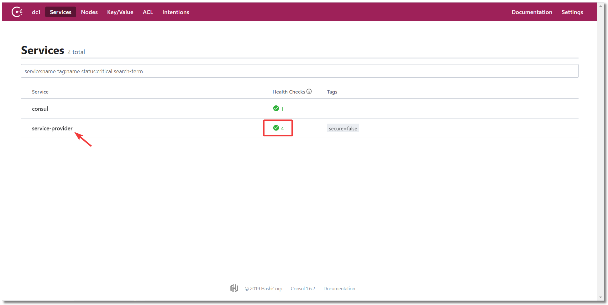

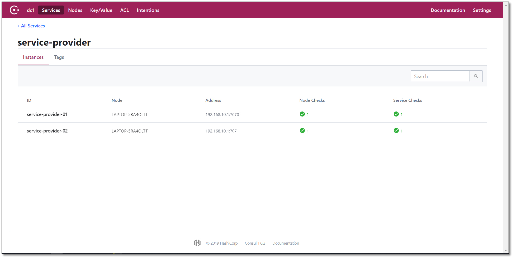


### 服务消费者 service-consumer


#### 创建项目


　　在刚才的父工程下创建一个 `service-consumer` 服务消费者的项目。

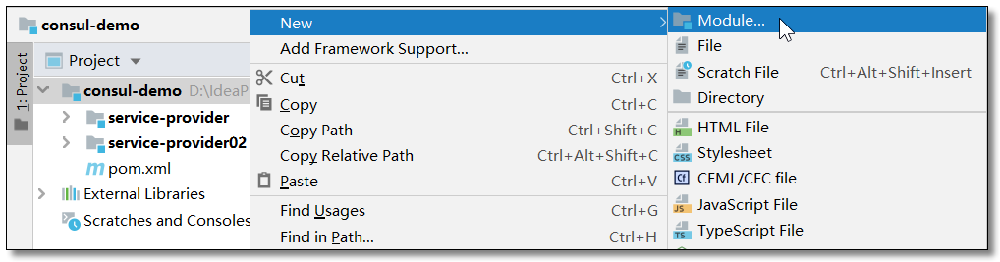


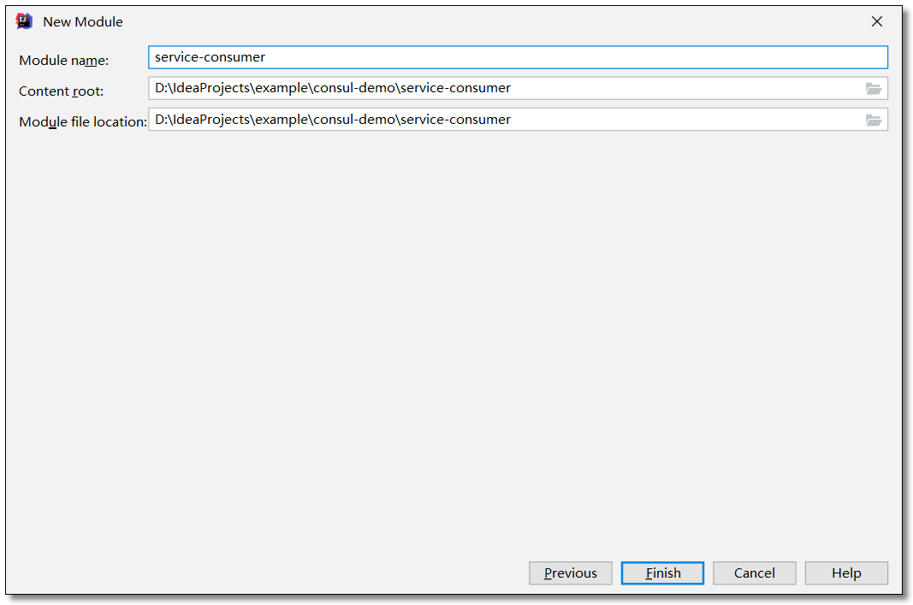


#### 添加依赖


　　pom.xml

```xml
<?xml version="1.0" encoding="UTF-8"?>

<project xmlns="http://maven.apache.org/POM/4.0.0" xmlns:xsi="http://www.w3.org/2001/XMLSchema-instance"
         xsi:schemaLocation="http://maven.apache.org/POM/4.0.0 http://maven.apache.org/xsd/maven-4.0.0.xsd">
    <modelVersion>4.0.0</modelVersion>

    <groupId>com.example</groupId>
    <artifactId>service-consumer</artifactId>
    <version>1.0-SNAPSHOT</version>

    <!-- 继承父依赖 -->
    <parent>
        <groupId>com.example</groupId>
        <artifactId>consul-demo</artifactId>
        <version>1.0-SNAPSHOT</version>
    </parent>

    <!-- 项目依赖 -->
    <dependencies>
        <!-- spring cloud consul 依赖 -->
        <dependency>
            <groupId>org.springframework.cloud</groupId>
            <artifactId>spring-cloud-starter-consul-discovery</artifactId>
        </dependency>
        <!-- spring boot actuator 依赖 -->
        <dependency>
            <groupId>org.springframework.boot</groupId>
            <artifactId>spring-boot-starter-actuator</artifactId>
        </dependency>
        <!-- spring boot web 依赖 -->
        <dependency>
            <groupId>org.springframework.boot</groupId>
            <artifactId>spring-boot-starter-web</artifactId>
        </dependency>
        <!-- lombok 依赖 -->
        <dependency>
            <groupId>org.projectlombok</groupId>
            <artifactId>lombok</artifactId>
            <scope>provided</scope>
        </dependency>

        <!-- spring boot test 依赖 -->
        <dependency>
            <groupId>org.springframework.boot</groupId>
            <artifactId>spring-boot-starter-test</artifactId>
            <scope>test</scope>
            <exclusions>
                <exclusion>
                    <groupId>org.junit.vintage</groupId>
                    <artifactId>junit-vintage-engine</artifactId>
                </exclusion>
            </exclusions>
        </dependency>
    </dependencies>

</project>
```


#### 配置文件


　　application.yml

```yml
server:
  port: 9090 # 端口

spring:
  application:
    name: service-consumer # 应用名称
  # 配置 Consul 注册中心
  cloud:
    consul:
      # 注册中心的访问地址
      host: localhost
      port: 8500
      # 服务提供者信息
      discovery:
        register: false                               # 是否需要注册
        instance-id: ${spring.application.name}-01    # 注册实例 id（必须唯一）
        service-name: ${spring.application.name}      # 服务名称
        port: ${server.port}                          # 服务端口
        prefer-ip-address: true                       # 是否使用 ip 地址注册
        ip-address: ${spring.cloud.client.ip-address} # 服务请求 ip
```


#### 实体类


　　Product.java

```java
package com.example.pojo;

import lombok.AllArgsConstructor;
import lombok.Data;
import lombok.NoArgsConstructor;

import java.io.Serializable;

@Data
@NoArgsConstructor
@AllArgsConstructor
public class Product implements Serializable {

    private Integer id;
    private String productName;
    private Integer productNum;
    private Double productPrice;

}
```


　　Order.java

```java
package com.example.pojo;

import lombok.AllArgsConstructor;
import lombok.Data;
import lombok.NoArgsConstructor;

import java.io.Serializable;
import java.util.List;

@Data
@NoArgsConstructor
@AllArgsConstructor
public class Order implements Serializable {

    private Integer id;
    private String orderNo;
    private String orderAddress;
    private Double totalPrice;
    private List<Product> productList;

}
```


#### 消费服务


　　OrderService.java

```java
package com.example.service;

import com.example.pojo.Order;

public interface OrderService {

    /**
     * 根据主键查询订单
     *
     * @param id
     * @return
     */
    Order selectOrderById(Integer id);

}
```

　　OrderServiceImpl.java

```java
package com.example.service.impl;

import com.example.pojo.Order;
import com.example.pojo.Product;
import com.example.service.OrderService;
import org.springframework.beans.factory.annotation.Autowired;
import org.springframework.core.ParameterizedTypeReference;
import org.springframework.http.HttpMethod;
import org.springframework.http.ResponseEntity;
import org.springframework.stereotype.Service;
import org.springframework.web.client.RestTemplate;

import java.util.List;

@Service
public class OrderServiceImpl implements OrderService {

    @Autowired
    private RestTemplate restTemplate;

    /**
     * 根据主键查询订单
     *
     * @param id
     * @return
     */
    @Override
    public Order selectOrderById(Integer id) {
        return new Order(id, "order-001", "中国", 22788D,
                selectProductListByLoadBalancerAnnotation());
    }

    private List<Product> selectProductListByLoadBalancerAnnotation() {
        // ResponseEntity: 封装了返回数据
        ResponseEntity<List<Product>> response = restTemplate.exchange(
                "http://service-provider/product/list",
                HttpMethod.GET,
                null,
                new ParameterizedTypeReference<List<Product>>() {
                });
        return response.getBody();
    }

}
```


#### 控制层


　　OrderController.java

```java
package com.example.controller;

import com.example.pojo.Order;
import com.example.service.OrderService;
import org.springframework.beans.factory.annotation.Autowired;
import org.springframework.web.bind.annotation.GetMapping;
import org.springframework.web.bind.annotation.PathVariable;
import org.springframework.web.bind.annotation.RequestMapping;
import org.springframework.web.bind.annotation.RestController;

@RestController
@RequestMapping("/order")
public class OrderController {

    @Autowired
    private OrderService orderService;

    /**
     * 根据主键查询订单
     *
     * @param id
     * @return
     */
    @GetMapping("/{id}")
    public Order selectOrderById(@PathVariable("id") Integer id) {
        return orderService.selectOrderById(id);
    }

}
```


#### 启动类


　　ServiceConsumerApplication.java

```java
package com.example;

import org.springframework.boot.SpringApplication;
import org.springframework.boot.autoconfigure.SpringBootApplication;
import org.springframework.cloud.client.loadbalancer.LoadBalanced;
import org.springframework.context.annotation.Bean;
import org.springframework.web.client.RestTemplate;

@SpringBootApplication
public class ServiceConsumerApplication {

    @Bean
    @LoadBalanced
    public RestTemplate restTemplate() {
        return new RestTemplate();
    }

    public static void main(String[] args) {
        SpringApplication.run(ServiceConsumerApplication.class, args);
    }

}
```


#### 访问


　　访问：http://localhost:9090/order/1 结果如下：


## Consul 集群


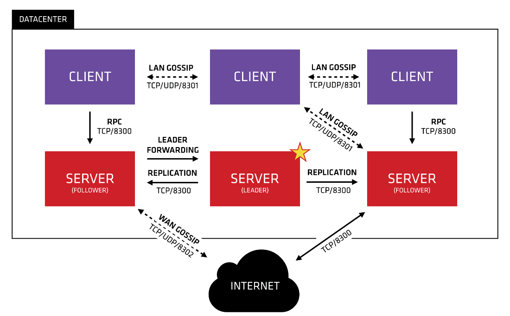


　　上图是一个简单的 Consul Cluster 架构，Consul Cluster 有 Server 和 Client 两种角色。不管是 Server 还是 Client，统称为 Agent，Consul Client 是相对无状态的，只负责转发 RPC 到 Server 资源开销很少。Server 是一个有一组扩展功能的代理，这些功能包括参与 Raft 选举，维护集群状态，响应 RPC 查询，与其他数据中心交互 WAN Gossip 和转发查询给 leader 或者远程数据中心。

　　每个数据中心，Client 和 Server 是混合的。一般建议有 3~5 台 Server。这是基于有故障情况下的可用性和性能之间的权衡结果，因为越多的机器加入达成共识越慢，Server 之间会选举出一个 Leader。然而并不限制 Client 的数量，一般建议一个服务对应一个 Client，它们可以很容易的扩展到数千或者数万台	。在开发时我们绑定一组服务注册中心中的客户端即可。


### 环境准备


| 服务器 IP      | Consul 类型 | Node 节点 |
| -------------- | ----------- | --------- |
| 192.168.10.101 | server      | server-01 |
| 192.168.10.102 | server      | server-02 |
| 192.168.10.103 | server      | server-03 |
| 192.168.10.1   | client      | client-01 |


### 安装


　　将安装包上传至服务器。

　　安装 unzip 命令，创建 consul 目录，将 consul 解压至指定目录。

```shell
yum -y install unzip 										# 安装 unzip
mkdir -p /usr/local/consul 									# 创建 consul 目录
unzip consul_1.7.0_linux_amd64.zip -d /usr/local/consul/ 	# 解压至 consul 目录
mkdir -p /usr/local/consul/data								# 创建 consul 数据目录
```


### 启动


#### 注册中心服务端


　　以 server 服务模式运行三台注册中心。

```shell
# node-01
./consul agent -server -bind=192.168.10.101 -client=0.0.0.0 -ui -bootstrap-expect=3 -data-dir=/usr/local/consul/data/ -node=server-01
# node-02
./consul agent -server -bind=192.168.10.102 -client=0.0.0.0 -ui -bootstrap-expect=3 -data-dir=/usr/local/consul/data/ -node=server-02
# node-03
./consul agent -server -bind=192.168.10.103 -client=0.0.0.0 -ui -bootstrap-expect=3 -data-dir=/usr/local/consul/data/ -node=server-03
```

　　参数含义如下：

- `-server`：以服务端身份启动（注册中心）
- `-bind`：表示绑定到哪个 ip

- `-client`：指定客户端访问的 ip，0.0.0.0 表示不限客户端 ip
- `-ui`：开启 web 界面访问

- `-bootstrap-expect=3`：表示 server 集群最低节点数为 3，低于这个值将工作不正常（注：类似 ZooKeeper一样，通常集群数为奇数方便选举，Consul 采用的是 Raft 算法）
- `-data-dir`：表示指定数据的存放目录（该目录必须存在，需提前创建好）
- `-node`：表示节点在 web ui 中显示的名称


#### 注册中心客户端


```shell
consul agent -client=0.0.0.0 -bind=192.168.10.1 -data-dir=D:\Example\consol\data -node=client-01
```


#### 关联集群


　　在 server-02 和 server-03 和 client-01 节点中输入以下命令建立集群关系。

```shell
./consul join 192.168.10.101
```

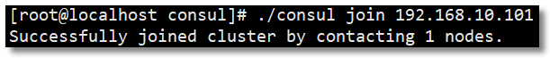

#### 集群状态


　　在任意一台服务器中输入以下命令可查看集群中所有节点信息。

```shell
./consul members
```

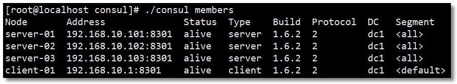


#### 访问


　　访问：http://192.168.10.101:8500/ 或者 http://192.168.10.102:8500/ 或者 http://192.168.10.103:8500/ 集群任意节点都可看到以下界面说明集群环境搭建成功。


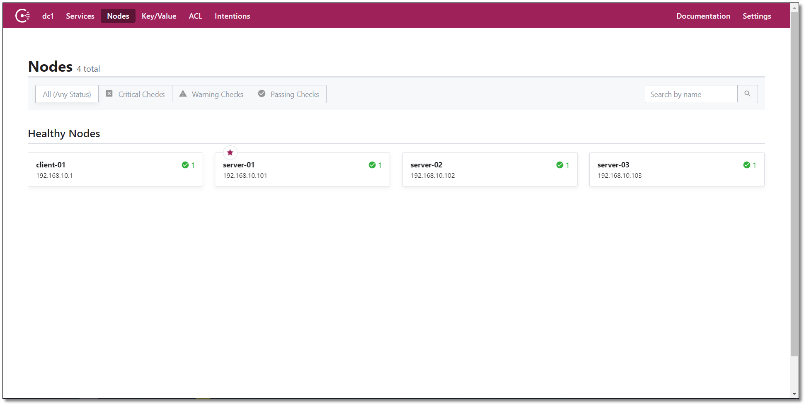


### 测试


　　service-provider 和 service-consumer 项目的配置文件和代码都无需更改，直接启动测试。

　　访问：http://192.168.10.101:8500/，结果如下：


　　访问：http://localhost:9090/order/1 结果如下：


　　经过测试服务正常可用，至此 Consul 服务注册中心所有的知识点就讲解结束了。非常感谢你可以认真学习至此，加油少年~

