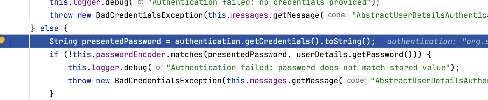

### 自定义用户认证
* 一个非常重要的接口 UserDetailsService<br>
每个支持的读取用户名和密码的机制都可以使用任何支持的存储机制<br>
1.使用 内存认证 的 Simple Storage<br>
2.使用 JDBC认证 的关系型数据库<br>
3.使用 UserDetailsService 的自定义数据存储<br>
4.使用 LDAP认证 的 LDAP storage<br>
可以查看该接口实现类
* 我们也可以自定义该接口实现类并将该对象交由spring管理来实现自定义登录认证<br>
```
  @Configuration
  public class MyUserDetailService implements UserDetailsService {
  
  @Override
  public UserDetails loadUserByUsername(String s) throws UsernameNotFoundException {
        User user = new User();
        user.setUserName("pt");
        user.setPassword("123");
        user.setEnabled(true);
        user.setAuthorities(new ArrayList<>());
        user.setAccountNonExpired(true);
        user.setCredentialsNonExpired(true);
        user.setAccountNonLocked(true);
        return user;
     }
  }
```
loadUserByUsername方法返回的对象包含了与给定用户名相关联的用户信息<br>
我们也可以自定义一个类实现该接口，将该类作为返回值 不做赘述 可看源码<br>
返回后，继续下面的判断，进行密码是否匹配，凭证是否过期等<br>
可以通过debug判断<br>

继续debug就到密码匹配<br>

可以看到这里有个passwordEncoder对象进行密码匹配,可以实现这个接口，自定义密码校验规则
并将该对象交由spring管理<br>
```
@Configuration
public class BasicConfig {

    @Bean
    public PasswordEncoder passwordEncoder(){
        return new PasswordConfig();
    }
}
    
public class PasswordConfig implements PasswordEncoder {
    // 用于对密码进行编码
    @Override
    public String encode(CharSequence charSequence) {
        System.out.println("编码"+charSequence.length());
        return null;
    }

    // 这里是密码匹配
    @Override
    public boolean matches(CharSequence charSequence, String s) {
        System.out.println("匹配"+s);
        return true;
    }

    @Override
    public boolean upgradeEncoding(String encodedPassword) {
        return PasswordEncoder.super.upgradeEncoding(encodedPassword);
    }
```
#### 通过接口认证不通过表单 <br>
```
@Service(value = "loginService")
public class LoginServiceImpl implements LoginService {
    @Resource(name = "Authentication")
    private AuthenticationManager authenticationManager;

    @Override
    public StatusUtil Login(String username, String password) {
        UsernamePasswordAuthenticationToken authentication = new UsernamePasswordAuthenticationToken(username,password);
        Authentication authenticate = authenticationManager.authenticate(authentication);
        if(authenticate.isAuthenticated()){
            return new StatusUtil("登录成功",200, (User) authenticate.getPrincipal());
        }else {
            return new StatusUtil("登录失败",200,null);
        }
    }
}
```
自定义AuthenticationManager<br>
```
 @Bean(name = "Authentication")
    @Override
    public AuthenticationManager authenticationManagerBean() throws Exception {
        return super.authenticationManagerBean();
    }
```


